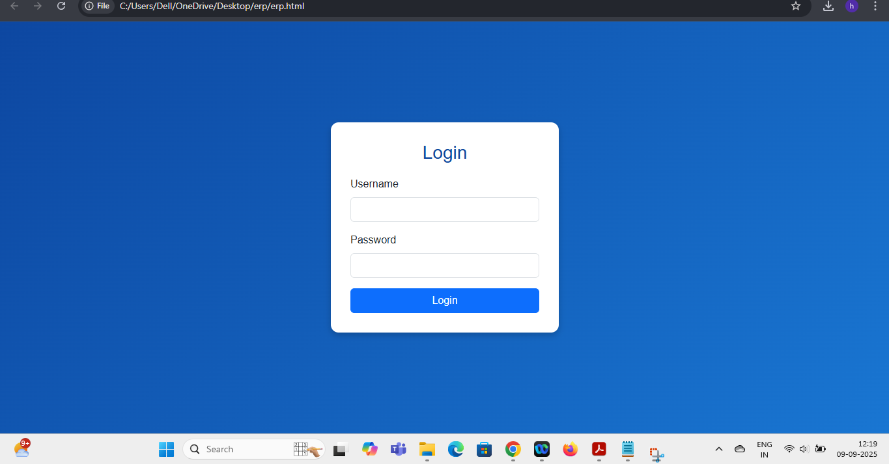
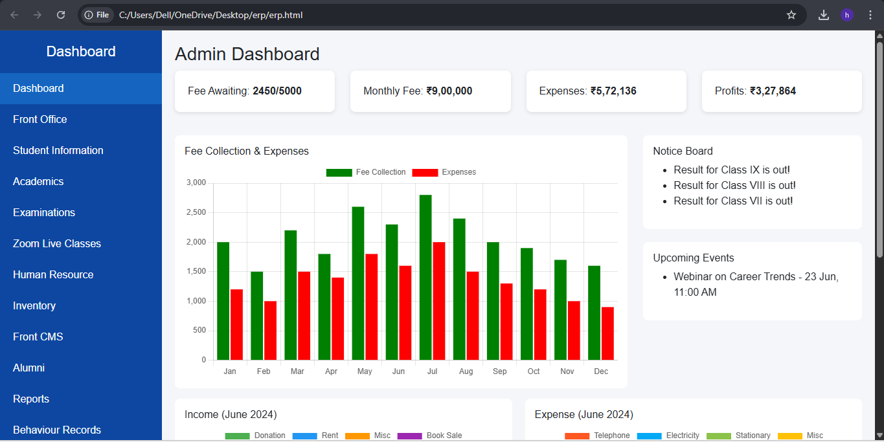
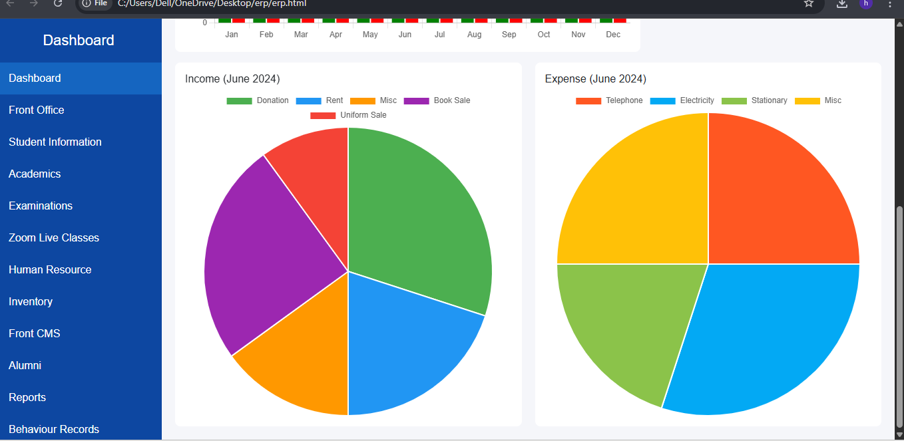

# College ERP Management System (2025)

**Tech Stack:** HTML, CSS, PHP, MySQL  
**Description:** College ERP system with modules for student registration, attendance tracking, fee management, and academic records.  

**Features:**
- Student Registration
- Attendance Tracking
- Fee Management
- Academic Records Dashboard

## 🚀 Demo / Screenshots

### 🔹 Login Page

### 🔹 Dashboard View 1

### 🔹 Dashboard View 2

**Status:** Frontend complete, backend demo with sample data
